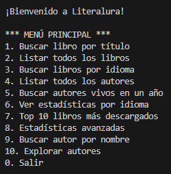
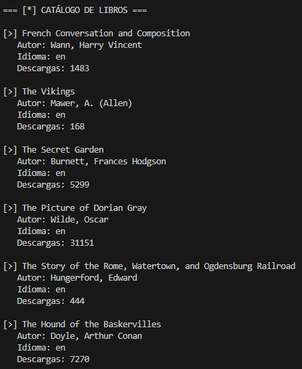
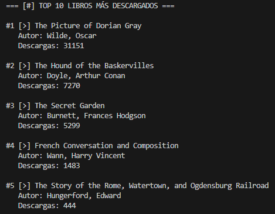
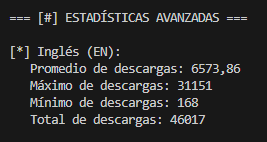

# LiterAlura: Catálogo de Libros 📚  

Bienvenido/a al proyecto **LiterAlura**. Este proyecto trata de un catálogo de libros, con consumo de APIs, manipulación de datos JSON, almacenamiento en bases de datos y creación de interacciones textuales en la consola. 🚀  

## Acerca del Proyecto 📖  

El objetivo principal de **LiterAlura** es desarrollar un Catálogo de Libros interactivo que permita a los usuarios:  
- Buscar libros en una API específica.  
- Filtrar y mostrar libros y autores de interés.  
- Almacenar la información obtenida en una base de datos.  
- Opciones de interacción textual en la consola.  

## Capturas de Pantalla 📸  
#### Menú del proyecto



#### Listado de libros

 

#### Top de libros

 

#### Estadísticas




### Características 🛠️  
- Solicitudes a una API de libros para obtener datos actualizados.  
- Almacenamiento de datos en una base de datos PostgreSQL.  
- Interacción con los usuarios a través de un menú textual.  
- Filtrado avanzado para encontrar libros y autores específicos.  
- Configuración sencilla y compatible con herramientas modernas.  

## Requisitos del Proyecto 📋  

El proyecto utiliza las siguientes tecnologías y versiones:  
- **Java JDK**: Versión 17 en adelante.  
  [Descargar Java LTS](https://www.oracle.com/java/technologies/javase-downloads.html)  
- **Maven**: Versión 4 en adelante.  
- **Spring Boot**: Versión 3.2.3.  
  [Generar proyecto Spring Boot](https://start.spring.io/)  
- **PostgreSQL**: Versión 16 en adelante.  
  [Descargar PostgreSQL](https://www.postgresql.org/download/)  
- **IDE IntelliJ IDEA** (opcional):  
  [Descargar IntelliJ IDEA](https://www.jetbrains.com/idea/download/)  

## Configuración Inicial ⚙️  

### Creación del Proyecto en Spring Initializr  
1. Configura el proyecto con las siguientes opciones:  
   - Lenguaje: **Java** (versión 17 o superior).  
   - Construcción: **Maven** (Initializr utiliza la versión 4).  
   - Spring Boot: **3.2.3**.  
   - Tipo de proyecto: **JAR**.  

2. Agrega las siguientes dependencias:  
   - **Spring Data JPA**.  
   - **Postgres Driver**.  

### Configuración de la Base de Datos  
1. Instala PostgreSQL (versión 16 o superior).  
2. Crea una base de datos para almacenar los libros y sus autores.  
3. Configura las credenciales en el archivo `application.properties` o `application.yml`.  

## Instalación y Uso 🚀  

1. Clona este repositorio:  
   ```bash
   git clone https://github.com/tu-usuario/literalura.git

2. Navega al directorio del proyecto:

    ```bash
    cd literalura
3. Importa el proyecto en tu IDE (IntelliJ IDEA recomendado).

4. Configura las credenciales de la base de datos en src/main/resources/application.properties:

    ```properties
    spring.datasource.url=jdbc:postgresql://localhost:5432/literalura
    spring.datasource.username=tu_usuario
    spring.datasource.password=tu_contraseña

5. Ejecuta el proyecto con el siguiente comando:

    ```bash
    mvn spring-boot:run

6. ¡Explora el catálogo de libros interactuando con el menú en la consola! 🌟

### Funcionalidades Principales 🎯

- Búsqueda de Libros: Conecta con una API para buscar libros por título, autor u otros criterios.
- Filtrado Avanzado: Encuentra libros y autores basados en tus preferencias.
- Base de Datos: Almacena y administra la información de los libros obtenidos.
- Interacción Textual: Ofrece un menú en la consola con 5 opciones de interacción.


### 🤝 Contribución

1. Fork el proyecto
2. Crea una rama para tu feature (`git checkout -b feature/AmazingFeature`)
3. Commit tus cambios (`git commit -m 'Add some AmazingFeature'`)
4. Push a la rama (`git push origin feature/AmazingFeature`)
5. Abre un Pull Request

## 📝 Notas de Implementación

- Se utiliza el patrón DTO para separar la capa de API de la capa de persistencia
- Implementación de caché en memoria para optimizar consultas frecuentes
- Manejo de errores robusto con mensajes amigables
- Validación de entrada de usuario
- Transacciones automáticas para operaciones de base de datos

### ✨ Agradecimientos

- [Proyecto Gutenberg](https://www.gutenberg.org/) por proporcionar la API
- [Oracle ONE](https://www.oracle.com/br/education/oracle-next-education/) por la oportunidad de aprendizaje
- [Alura](https://www.aluracursos.com/) por el contenido educativo

### Sobre Mí 🙋‍♀️
Soy María Cámpora, estudiante de Alura. Este proyecto forma parte de mi aprendizaje en desarrollo de software, y estoy emocionada de compartirlo contigo. Si tienes alguna sugerencia o pregunta, no dudes en contactarme.

### Licencia 📜
Este proyecto está bajo la Licencia MIT 